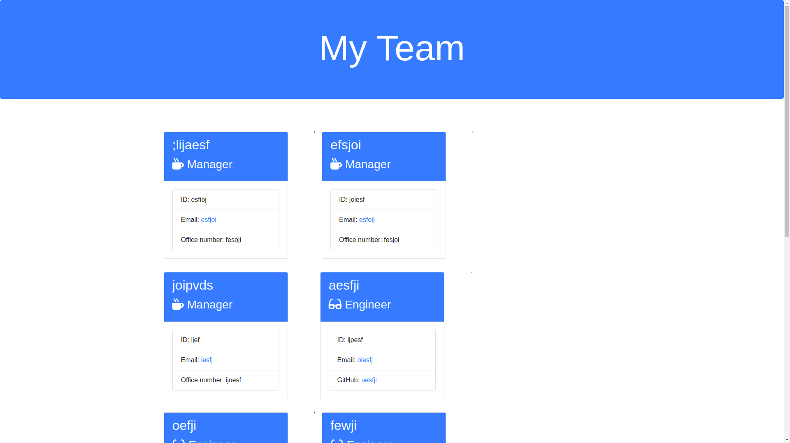
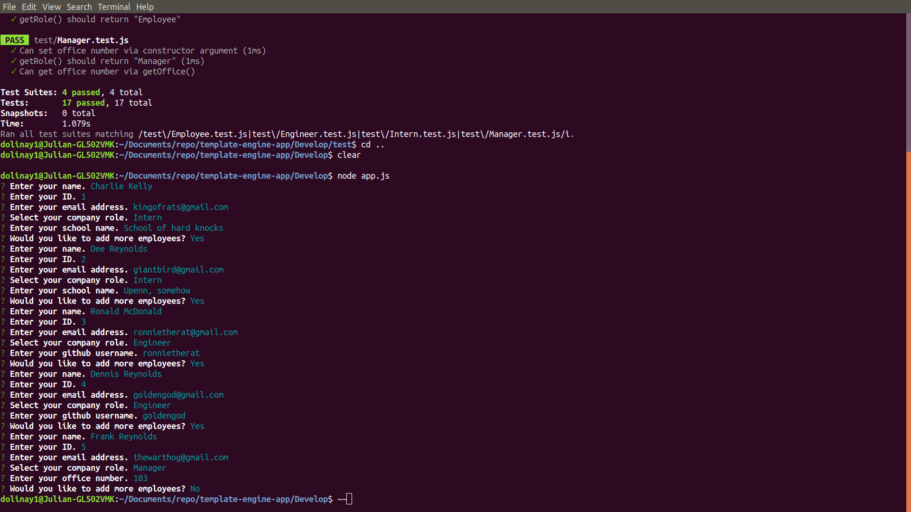

# Template Engine App

## Description
This application works enirely in the Node cli and is used to generate an html page with employee description cards depending on the user input. The user is given a series of prompts that take in the user's input and for the cards.

## Installation
To install run npm install

## Tests
To run tests, npm run test

## Images
* HTML Ouput

* Node cli application

## Video
https://drive.google.com/open?id=1-68ZonaRmMSpBpgLSKYNd0BMyT5-cc11

